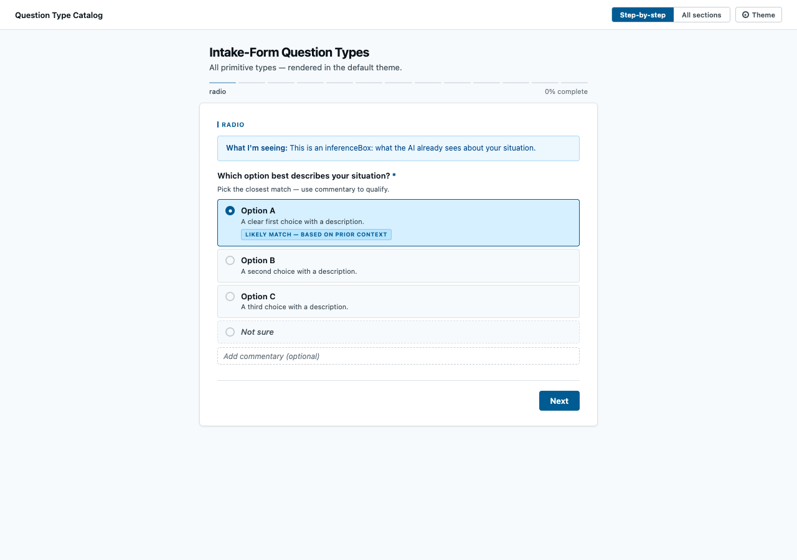

# Intake Form

**Turn an underspecified request into a clean, native-feeling HTML form by filling in one JSON spec — no form HTML by hand, no backend, no build step.** The reviewer fills it out in the browser and clicks **Copy for Claude**; you get back a structured, agent-ready payload.



<sub>**Try it:** open [`examples/question-type-catalog.html`](examples/question-type-catalog.html) in any browser — one self-contained file showing every question type.</sub>

## Why this exists

Agents do their worst work when the request is vague. The usual fix is a wall of clarifying questions in chat, which is slow, easy to lose, and hard for a person to answer carefully. The other failure mode is just as bad: an agent (or a developer) hand-writing form HTML, which drifts, duplicates state across views, and quietly breaks.

Intake Form is the small thing in between. You describe the questions as a **JSON spec**; a single bundled renderer builds the whole form — both a step-by-step wizard *and* an all-sections view — from that one source. The human answers in a calm, well-designed UI, and the export comes back as a tidy block an agent can act on directly.

It came out of agent workflows: before starting ambiguous work, an agent generates a form, the human fills it in, and the answers flow back as structured context instead of a half-remembered chat thread.

## Who it's for

Anyone who wants a person's input captured **structured and unambiguous** before work begins — without standing up a survey tool, a database, or a login.

- **Scoping agent work.** An agent hits 2+ real gaps, generates a form, and waits for a grounded brief instead of guessing.
- **Lightweight requirements gathering.** Drop a form into any project folder, send the file, get a clean export back.
- **Decision intake.** Capture the frame of a decision (reversibility, stakes, deciders, constraints) in one pass.

## What you get back

The reviewer clicks **Copy for Claude** and the renderer auto-formats every answer into a labeled export — no custom code:

```
=== INTAKE EXPORT ===

REVERSIBILITY:  Easily reversible
CONSTRAINTS:    Time | Compliance
EFFORT:         30 — Trivial
FORMAT:         Report
REPORT_PAGES:   10

--- Context already known ---
User: a senior engineer on a small product team.

--- Routing suggestion ---
ask.reversibility     -> route to a structured decision workflow ...
```

## Quick start

There is no install step for the form itself — it's a template plus a renderer.

**As an agent skill (Claude Code, Codex, or any SKILL.md-aware agent).** Drop this folder into your skills directory (e.g. `~/.claude/skills/intake-form` for Claude Code, `~/.agents/skills/intake-form` for Codex). The agent reads [`SKILL.md`](SKILL.md), fills the spec inside [`template.html`](template.html), and saves a form to your project.

**As a Claude Code plugin.**

```
/plugin marketplace add spunt/intake-form
/plugin install intake-form@intake-form
```

**By hand.** Open [`template.html`](template.html), replace the JSON inside `<script id="form-spec">` with your own spec (schema in [`SKILL.md`](SKILL.md)), and open the file in a browser. To produce a self-contained form that works anywhere, inline `ifbase.css` and `ifbase.js` into the saved file — see [`examples/question-type-catalog.html`](examples/question-type-catalog.html) for the result.

## How it works

- **One spec, two views.** `ifbase.js` reads a single `<script id="form-spec">` block and builds *both* the wizard and the grouped layout from it, keeping state in sync. There is no second copy of the questions to drift out of sync — the structural fix for the classic "duplicate the DOM and one copy goes empty" bug.
- **Native controls.** Real `<input>`/`<textarea>`/range elements, keyboard-navigable, with an inference box, pre-selected best-guess options, a required "Not sure" escape hatch, and an optional commentary field on every closed-choice question.
- **Themeable from the spec.** A single `--if-*` OKLCH token layer drives color, type, motion, and density. Set a `theme` block (`preset`, `hue`, `palette`, …) in the spec; no per-form CSS. Presets ship for `default`, `editorial`, and `terminal`.
- **Client-side only.** Nothing is sent anywhere. Answers live in the page until the user clicks Copy for Claude or exports.

## Question types

`radio` · `checkbox` · `text` · `textarea` · `scale` · `slider` · `segmented` · `priority-rank` (drag-reorder) · `file-upload` (base64-embedded) · `narrative-card` (non-input story beat) · `embedded-media` · plus per-option `multi-branch` follow-ups. Every type is demonstrated in [`examples/question-type-catalog.html`](examples/question-type-catalog.html); the full schema and authoring rules are in [`SKILL.md`](SKILL.md).

## Quality

The renderer is backed by a verification harness in [`tools/`](tools/): `render-test.mjs` (headless Playwright render → screenshot + console-error capture + export capture against golden files in [`test-specs/`](test-specs/)) and `axe-audit.mjs` (programmatic accessibility audit on both views). Every shipped question type and theme preset has a golden export captured under `test-specs/`.

```bash
cd tools && npm install
node render-test.mjs ../test-specs/demo-all.json
node axe-audit.mjs ../test-specs/demo-all.json
```

## License

[MIT](LICENSE) © 2026 Bob Spunt. Use it in anything, including commercial work. Keep the copyright notice.
